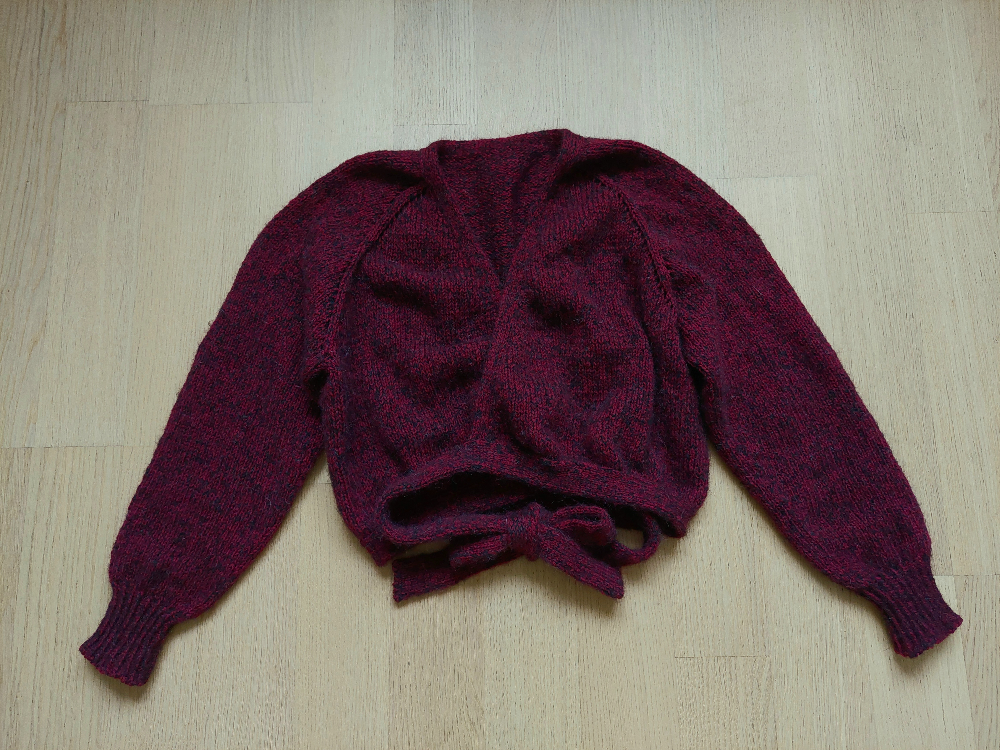

---
tags:
  - AssemblyFree
  - Raglan
  - TopDown
  - V-neck
title: Cropped Wrap Cardigan
---

I was looking through a bunch of knitting patterns online for a simple wrap cardigan like this and I couldn't find anything I could use. So... I tried to write my own.

I made two cardigans using this pattern for size S, each time with a different size of needles to show that it affects the finished size of the piece. If I switch for needles bigger by 1 mm, I'd go with the pattern for one size smaller (for example if I wanted to make it in XS, I'd use 2,5 mm needles for the body following the guide for size S). See pictures below.

The oatmeal colored one is made on 3 mm and 2,5 mm needles for the rib and placket. The finished size is XS/S and it lies flat on the torso since the difference in needle size is small. I balanced the tight fit with straight sleeves that look a bit balloony with the tighter wrist bands. The yarn I used is called Alize Angora gold (80 % acrylic, 20 % wool).

The burgundy cardigan is made on 5 mm and 3,5 mm needles for the rib and placket (yarn as described in the pattern in a dark red color and a very thin yarn from mohair/merino/viscose blend as I was looking for a more drapey result). It creates a looser fit (size M/L) with a blousy effect around the waist due to the bigger difference between the needle sizes. Thanks to the longer yoke the armholes are looser and create more of a batwing sleeve effect. Because of that the straight sleeves would be too dramatic for my taste so I came up with a tapered sleeve version. Both versions of the sleeves are included in the following pattern. I made the waist tie a bit wider and shorter in this versions, so it ties at the back with a bow or all around in front with a small knot. It's also possible not to wrap it around the body at all and just tie it right in front with a big bow, leaving the cardigan looser around the waist.
Enjoy!

## Knitting Pattern by @anetlynx

Knitted cardigan with long sleeves. Top down, raglan, V-neck, assembly free.

**Size:**
S-M-L for needles 3,5 mm (for the body of the cardigan) and 2,5 mm for the rib

**Materials:**
I used Alize Angora gold (80 % acrylic, 20 % wool)
200-300-300 g colour 152

**Overview of the Pattern:**
The cardigan is worked top down, back and forth, starting with the yoke. The stitches are divided for the body and sleeves and worked separately. Sleeves are knitted in the round on a short circular needle or double-pointed needles. Then a double knitted placket is added and the whole cardigan is finished with a double knitted ribbon around the waist.

**Abbreviations:**
- st – stitch
- k – knit
- p – purl
- yo – yarn over
- k2tog – knit two together
- ssk – slip, slip, knit (can be replaced with s, k, psso)
- psso – pass slipped stitch over

### Yoke

Cast on 64-70-76 stitches with the back loop method on circular needle size 3.5 mm.

Purl one row from wrong side.

Insert 4 markers for raglan:
- 1st marker – after the first 3-3-3 stitches (left front)
- 2nd marker – after the next 12-14-16 stitches (left sleeve)
- 3rd marker – after the next 34-36-38 stitches (back)
- 4th marker – after the next 12-14-16 stitches (right sleeve)
- 3 stitches remain (right front)

Then work in stocking stitch (k rows from right side, p rows from wrong side) with 1 edge stitch in garter stitch (garter stitch – knit all rows, back and forth, 1 ridge = 2 rows) along the whole piece. At the same time from the first row from the right side increase for raglan (markers).

Increases for **raglan**: Start one st before the marker, make 1 yo, k 2 st (marker lies between these two st), 1 yo, continue stocking stitch. In the next (wrong side) row, purl the yarn overs the regular way to create little holes along the raglan seam (in pictures) or purl them twisted to avoid these holes.

Every row from the right side, 8 st are increased in total. Increase for raglan every other row (every row from right side) 28-32-36 times in total. At the same time increase for **V-neck** inside the one edge st on right side rows (how to: make 1 yo after the edge st at the beginning of the row and 1 yo before the edge st at the end of the row. On the next row /wrong side/, purl the yarn overs twisted to avoid holes) like this: increase 1 st on each side of the piece every 6th row 2 times, then every 4th row until the desired length is achieved.

After the last increase for raglan, the piece should be around 20-23-26 cm long from the cast-on edge. Continue increases for the V-neck. Next row from the right side: Work until 1st marker, slip the next 68-76-88 st on a stitch holder for a sleeve (until the next marker), cast on 8-10-12 new st (under left arm), work 90-100-110 st (back, until the next marker), slip the next 68-78-88 st on a stitch holder for the second sleeve (until the next marker), cast on 8-10-12 new st (under right arm), and work the remaining st (right front). Body and sleeves are finished separately.

### Body

Continue with stocking stitch with 1 edge st in garter stitch and continue to increase for the V-neck edge. When the piece measures around 18 cm from the armhole (it can be adjusted to the length you desire), put the st aside. It will be connected to the waist tie later.

### Sleeve

*Both Versions* – Slip the 68-78-88 st from the stitch holder to a short circular needle or double-pointed needles size 3.5 mm and pick up stitches from each of the 8-10-12 st cast on for underarm → 76-88-100 st. Start knitting in the middle of the new underarm stitches (put a marker there) and continue in the round with stocking stitch.

1. *Straight Sleeve Version* – Continue with the same number of stitches until your desired length (there is approximately 6 cm left to be finished in rib). On the next round, decrease the number of stitches by k2tog every two st → 38-44-50 st.
2. *Tapered Sleeve Version* – When the sleeve measures 1 cm from the armhole, decrease 2 st like this: start 3 st before the marker and k2tog, k2 stitches (the marker lies between these two st), ssk. Decrease like this every 2-1.5-1 cm 15-17-19 times in total → 46-54-62 st. When the sleeve measures 32-30-28 cm from the armhole, decrease 8-10-12 st evenly → 38-44-50 st.

*Both Versions* – Switch to needle(s) size 2.5 mm and work rib k1/p1 for 6 cm. Cast off with your preferred method to leave a flexible edge, like the Italian bind-off method (described below). Work the other sleeve the same way.

> [!note]+
> If you want to have the cuff tighter around your wrist, I recommend working all the k st through the back loop, it creates a more fitted, but equally flexible cuff with a sharper ribbed look.

### Italian Bind-Off

Cut the yarn about four times the length of the edge you are about to finish and thread the tapestry needle with it. The first st to bind off is a knit stich. Go through it with the needle purl-wise. Then continue like this:

1. When there’s a knit stitch first on the left needle – Go through the second stitch on the needle (a purl stitch) knit-wise, then go through the first stitch knit-wise and bind this one stitch off. Lightly pull the thread (pulling too much decreases the stretchiness of the hem).

2. When there’s a purl stitch first on the left needle – Go through the second stitch on the needle (a knit stitch) purl-wise, then go through the first stitch purl-wise and bind the one stitch off. Lightly pull the thread and go with the tapestry needle from back to front between the first two stitches currently on the left needle (p is second and k is first on the needle).

Continue switching steps 1 and 2 until there is one last stitch left (a purl stitch). Go through it purl-wise and bind it off the needle. Close the gap between the beginning and the end of the hem by pulling the thread through the beginning of the round. Weave in the end of the yarn and cut it off.

### Double-Knitted Placket

Pick up stitches along the neck edge, starting on the right bottom edge (when worn), one stitch from each row on a needle size 2.5 mm. Cast on 9 new st on the same needle where you started picking up stitches (Italian cast on method works best).

Row 1 (right side): \*1k, 1 slip with yarn in the front (swyif)\*, repeat \*–\* four times, k the last stitch of the placket together with 1 picked up stitch from the neck edge through the back loops.

Row 2 (wrong side): \*1 swyif, 1k\*, 1swyif.

Repeat with all the picked up stitches around the whole edge. At the end, keep the stitches on the needle with the rest of the cardigan.

### Waist Tie

Cast on an odd number of stitches depending on how wide you want the tie to be, for example, 13 st with Italian cast on method on a 2.5 mm needle. Continue with double knitting as with the placket on its own for at least 70 cm or as long as you desire. Then start attaching the belt to the cardigan the same way as you were with the placket. After all stitches from the bottom of the cardigan are attached, pick up stitches from the beginning of the placket and attach those too. Continue knitting the belt to make the ends equally long. Bind off using the Italian method.

> [!note]+
> I made the tie 70 cm long before attaching it to the bottom of the burgundy cardigan, so it ties in the back with a bow or all the way around in the front with a small knot. With the oatmeal one 90 cm was enough to tie it with a bow after wrapping it around my body.

**Weave in the ends, and you are finished!**

